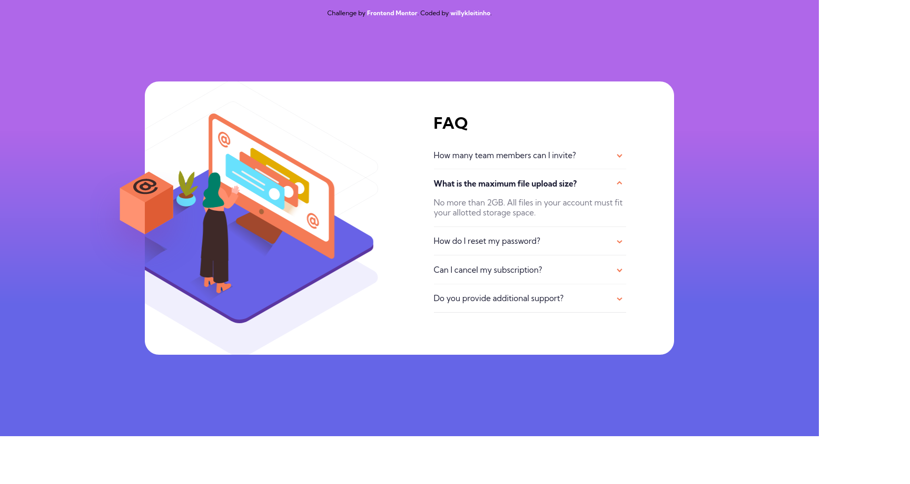

# Frontend Mentor - FAQ accordion card solution

This is a solution to the [FAQ accordion card challenge on Frontend Mentor](https://www.frontendmentor.io/challenges/faq-accordion-card-XlyjD0Oam). Frontend Mentor challenges help you improve your coding skills by building realistic projects. 

## Table of contents

- [Overview](#overview)
  - [The challenge](#the-challenge)
  - [Screenshot](#screenshot)
  - [Links](#links)
- [My process](#my-process)
  - [Built with](#built-with)
  - [What I learned](#what-i-learned)
  - [Useful resources](#useful-resources)
- [Author](#author)

## Overview

### The challenge

Users should be able to:

- View the optimal layout for the component depending on their device's screen size
- See hover states for all interactive elements on the page
- Hide/Show the answer to a question when the question is clicked

### Screenshot

### Links

- Solution URL: [on Frontend Mentor](https://www.frontendmentor.io/solutions/faq-accordion-card-cssonly-0--1bEv4lny)
- Live Site URL: [on Github Pages](https://willykleitinho.github.io/faq-accordion-css-only/)

## My process

### Built with

- Semantic HTML5 markup
- CSS custom properties
- Flexbox
- Mobile-first workflow
- Accordion CSS-only

### What I learned

In this project, I've learned how to use background images (with fallback colors) better and practiced using Flexbox. I also did my first accordion, using only labels and checkboxes :0

### Useful resources

- [CSS Gradient](https://cssgradient.io/) - CSS gradient generator.

## Author

- Github - [willykleitinho](https://github.com/willykleitinho)
- Frontend Mentor - [@willykleitinho](https://www.frontendmentor.io/profile/willykleitinho)
